# GitHub Actions MCP Server 設計書

## 概要

GitHub Actions のワークフロー実行履歴・ログをAgent Coreから調査できるMCPサーバーを新規作成する。デプロイ失敗時の原因調査や、CI/CDパイプラインの状態監視をAIエージェント経由で行えるようにする。

---

## 現状構成

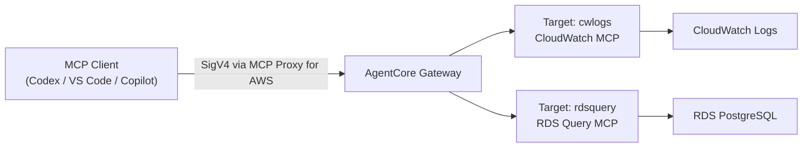

## 目標構成

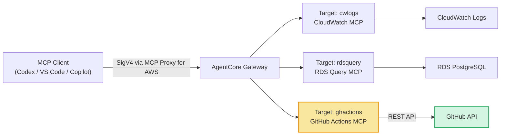

---

## アーキテクチャ詳細

### RDS MCP との構成比較

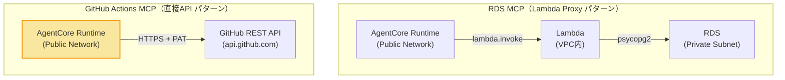

**GitHub APIはパブリックエンドポイント**のため、RDSのようなLambda Proxyは不要。AgentCore Runtimeから直接HTTPSで接続できる。

### コンポーネント図

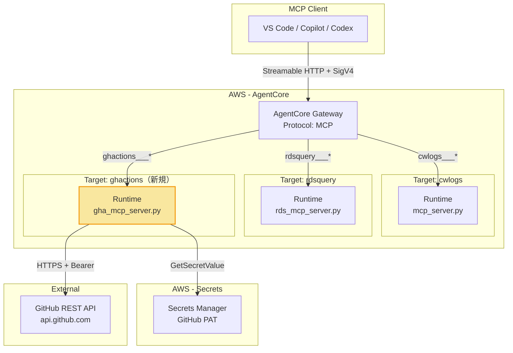

---

## 認証フロー

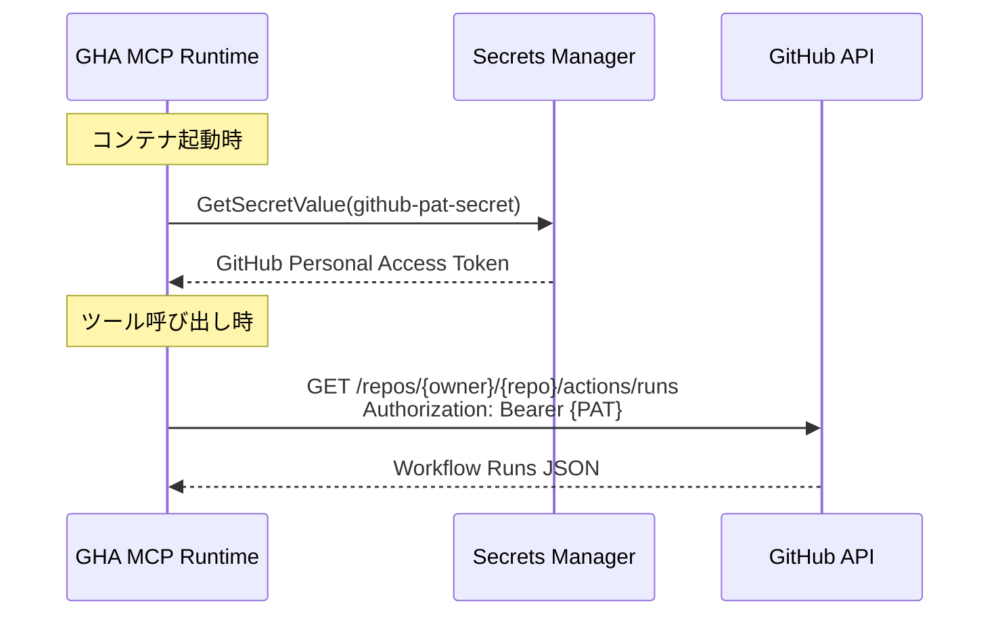

### GitHub PAT に必要なスコープ

| スコープ | 理由 |
|---|---|
| `actions:read` | ワークフロー実行履歴・ログの取得 |
| `contents:read` | ワークフロー定義ファイルの参照（任意） |

**Fine-grained PAT** を推奨（対象リポジトリを限定可能）。

---

## MCP Server 設計

### 提供ツール一覧

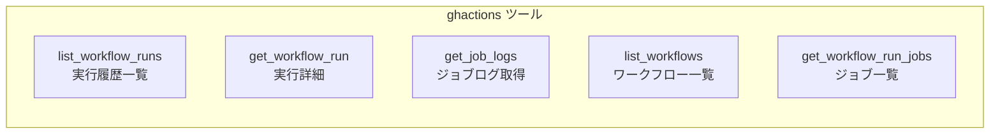

| ツール名 | 説明 | パラメータ |
|---|---|---|
| `list_workflow_runs` | ワークフロー実行履歴を取得 | `status` (optional), `branch` (optional), `limit` (default: 10) |
| `get_workflow_run` | 特定の実行の詳細を取得 | `run_id: int` |
| `get_workflow_run_jobs` | 実行内のジョブ一覧とステータス | `run_id: int` |
| `get_job_logs` | 特定ジョブのログを取得 | `job_id: int`, `tail_lines` (default: 100) |
| `list_workflows` | リポジトリのワークフロー定義一覧 | なし |

### ツール詳細

#### `list_workflow_runs`

```python
@mcp.tool()
def list_workflow_runs(
    status: str = "",
    branch: str = "",
    limit: int = 10,
) -> dict[str, Any]:
    """
    GitHub Actionsのワークフロー実行履歴を取得する。
    status: "completed", "in_progress", "queued", "failure", "success" など
    branch: フィルタするブランチ名
    """
```

**レスポンス例:**
```json
{
  "ok": true,
  "repository": "matthewTechCom/todo_sample",
  "total_count": 25,
  "runs": [
    {
      "id": 12345678,
      "name": "Deploy Backend",
      "status": "completed",
      "conclusion": "failure",
      "branch": "main",
      "commit_sha": "abc1234",
      "commit_message": "Fix API endpoint",
      "actor": "shimizuyuhri",
      "created_at": "2026-03-20T10:00:00Z",
      "updated_at": "2026-03-20T10:05:30Z",
      "run_duration_seconds": 330,
      "url": "https://github.com/matthewTechCom/todo_sample/actions/runs/12345678"
    }
  ]
}
```

#### `get_workflow_run`

```python
@mcp.tool()
def get_workflow_run(run_id: int) -> dict[str, Any]:
    """特定のワークフロー実行の詳細情報を取得する。"""
```

**レスポンス例:**
```json
{
  "ok": true,
  "run": {
    "id": 12345678,
    "name": "Deploy Backend",
    "status": "completed",
    "conclusion": "failure",
    "branch": "main",
    "event": "push",
    "commit_sha": "abc1234",
    "commit_message": "Fix API endpoint",
    "actor": "shimizuyuhri",
    "triggering_actor": "shimizuyuhri",
    "created_at": "2026-03-20T10:00:00Z",
    "run_attempt": 1,
    "jobs_url": "https://api.github.com/repos/.../actions/runs/12345678/jobs",
    "logs_url": "https://api.github.com/repos/.../actions/runs/12345678/logs"
  }
}
```

#### `get_workflow_run_jobs`

```python
@mcp.tool()
def get_workflow_run_jobs(run_id: int) -> dict[str, Any]:
    """ワークフロー実行内の全ジョブとステップのステータスを取得する。"""
```

**レスポンス例:**
```json
{
  "ok": true,
  "run_id": 12345678,
  "jobs": [
    {
      "id": 98765432,
      "name": "Deploy backend to ECS",
      "status": "completed",
      "conclusion": "failure",
      "started_at": "2026-03-20T10:00:15Z",
      "completed_at": "2026-03-20T10:05:30Z",
      "steps": [
        {"name": "Checkout", "status": "completed", "conclusion": "success", "number": 1},
        {"name": "Configure AWS credentials", "status": "completed", "conclusion": "success", "number": 2},
        {"name": "Build and push backend image", "status": "completed", "conclusion": "failure", "number": 6}
      ]
    }
  ]
}
```

#### `get_job_logs`

```python
@mcp.tool()
def get_job_logs(job_id: int, tail_lines: int = 100) -> dict[str, Any]:
    """
    特定ジョブのログを取得する。
    tail_lines でログ末尾の行数を制限（デフォルト100行、最大500行）。
    失敗ステップのログ調査に最適。
    """
```

**レスポンス例:**
```json
{
  "ok": true,
  "job_id": 98765432,
  "job_name": "Deploy backend to ECS",
  "log_lines": 87,
  "truncated": false,
  "logs": "2026-03-20T10:03:12Z ##[group]Build and push backend image\n2026-03-20T10:05:28Z ERROR: failed to solve: ...\n..."
}
```

#### `list_workflows`

```python
@mcp.tool()
def list_workflows() -> dict[str, Any]:
    """リポジトリに定義されているワークフローの一覧を取得する。"""
```

**レスポンス例:**
```json
{
  "ok": true,
  "repository": "matthewTechCom/todo_sample",
  "workflows": [
    {"id": 111, "name": "Deploy Backend", "path": ".github/workflows/deploy-backend.yml", "state": "active"},
    {"id": 222, "name": "Deploy Frontend", "path": ".github/workflows/deploy-frontend.yml", "state": "active"}
  ]
}
```

---

## ユースケース

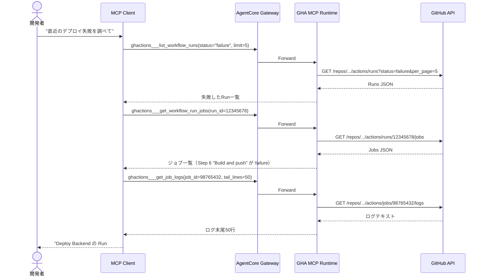

### 他MCPとの連携シナリオ

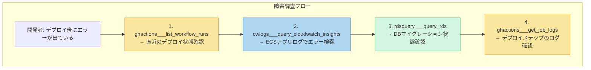

---

## セキュリティ設計

### 多層防御

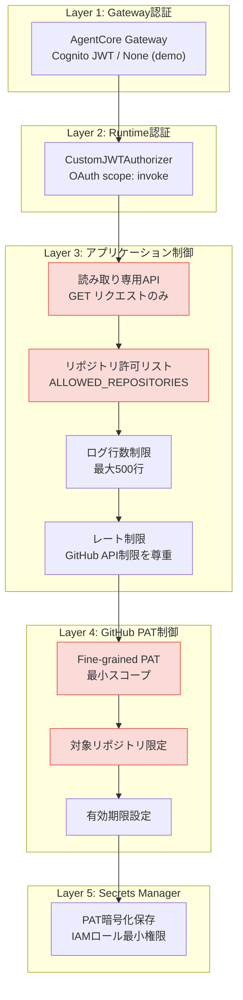

### GitHub API レート制限

| 認証方式 | 制限 | 備考 |
|---|---|---|
| PAT (authenticated) | 5,000 req/hour | 十分 |
| 未認証 | 60 req/hour | 不十分 |

MCP Serverは毎回のツール呼び出しでAPIリクエストを送るため、PATによる認証は必須。

---

## ディレクトリ構成

```
devops_agent/
├── mcp_server.py                          # 既存: CloudWatch MCP Server
├── rds_mcp_server.py                      # 既存: RDS MCP Server
├── gha_mcp_server.py                      # 新規: GitHub Actions MCP Server
├── Dockerfile                             # 既存: CloudWatch用
├── Dockerfile.rds                         # 既存: RDS用
├── Dockerfile.gha                         # 新規: GitHub Actions用
├── requirements.txt                       # 既存
├── requirements-rds.txt                   # 既存
├── requirements-gha.txt                   # 新規
└── terraform/
    ├── # 既存ファイル（変更あり）
    ├── locals.tf                          # 更新: GHA用ローカル変数追加
    ├── variables.tf                       # 更新: GHA用変数追加
    ├── outputs.tf                         # 更新: GHA用出力追加
    ├── # 新規ファイル
    ├── gha_runtime.tf                     # 新規: Runtime + ECR + IAM + Secrets
    ├── gha_gateway_target.tf              # 新規: Gateway Target追加
    └── templates/
        ├── gha_runtime.yaml.tftpl         # 新規: Runtime CFn テンプレート
        └── gha_gateway_target.yaml.tftpl  # 新規: Gateway Target CFn テンプレート
```

---

## Terraform リソース追加一覧

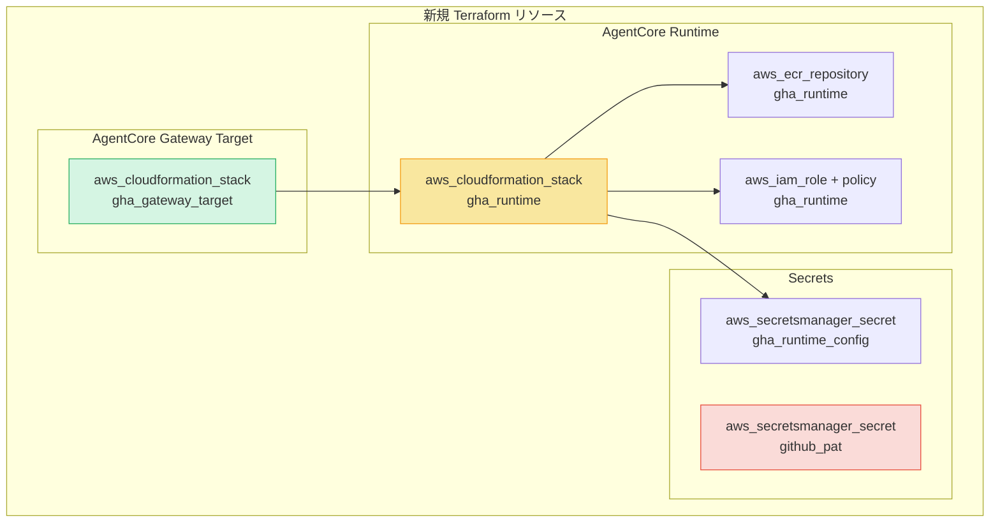

### RDS MCP との比較（シンプルさ）

| 項目 | RDS MCP | GitHub Actions MCP |
|---|---|---|
| ネットワーク | Lambda Proxy 必要 | 直接HTTPS（Lambda不要） |
| VPC | todo_sample VPC内に配置 | VPC不要 |
| Security Group | Lambda SG + RDS SG ルール | なし |
| DB認証 | Secrets Manager (DATABASE_URL) | Secrets Manager (GitHub PAT) |
| 追加AWSリソース | Lambda + SG + SG Rules | なし |
| Terraform 新規ファイル | 3ファイル | 2ファイル |

GitHub Actions MCPはLambda Proxyが不要な分、**RDS MCPよりシンプルな構成**になる。

---

## 設定値一覧

### 環境変数 (GHA MCP Server)

| 変数名 | 説明 | デフォルト |
|---|---|---|
| `GITHUB_PAT_SECRET_ID` | GitHub PATのSecrets Manager ARN | (必須) |
| `GITHUB_REPOSITORY` | 対象リポジトリ（owner/repo形式） | (必須) |
| `ALLOWED_REPOSITORIES` | 許可リポジトリのCSV | (GITHUB_REPOSITORYのみ) |
| `LOG_TAIL_MAX_LINES` | ログ取得の最大行数 | `500` |
| `RUNTIME_CONFIG_SECRET_ID` | Runtime設定のSecrets Manager ARN | (必須) |

### Terraform 変数

| 変数名 | 説明 | デフォルト |
|---|---|---|
| `gha_runtime_image_tag` | コンテナイメージタグ | `latest` |
| `github_pat_secret_arn` | GitHub PATのSecrets Manager ARN（手動作成） | `""` |
| `github_repository` | 対象リポジトリ | `matthewTechCom/todo_sample` |
| `gha_allowed_repositories` | 許可リポジトリリスト | `null`（= github_repositoryのみ） |

---

## 実装ステップ

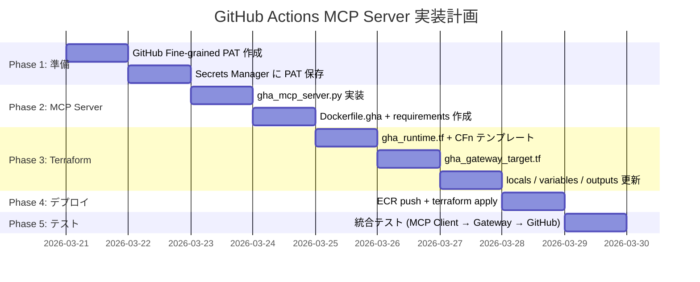

---

## データフロー詳細

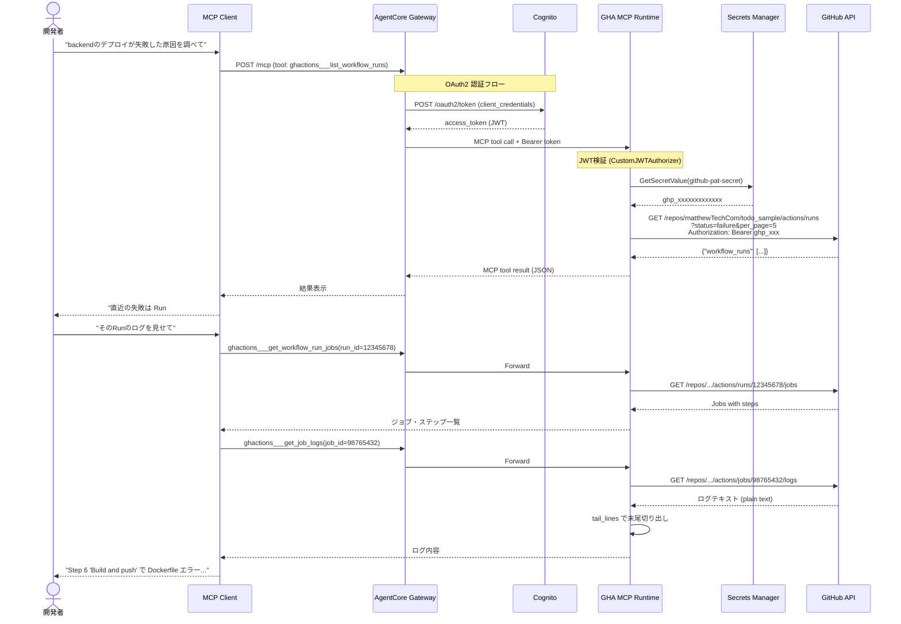

---

## 既存MCPサーバーとの比較

| 項目 | CloudWatch MCP | RDS MCP | GitHub Actions MCP (新規) |
|---|---|---|---|
| データソース | CloudWatch Logs | RDS PostgreSQL | GitHub REST API |
| 接続方式 | boto3 (IAM) | Lambda Proxy → psycopg2 | httpx + PAT |
| ネットワーク | Public API | Lambda (VPC) → Private RDS | Public API |
| 認証 | IAMロール | IAMロール + DB認証 | GitHub PAT |
| Lambda | 不要 | 必要 | 不要 |
| VPC | 不要 | 必要 | 不要 |
| Target名 | `cwlogs` | `rdsquery` | `ghactions` |
| ツール数 | 1 | 3 | 5 |
| Container | `Dockerfile` | `Dockerfile.rds` | `Dockerfile.gha` |
| 追加依存 | boto3 | boto3 | httpx, boto3 |
| 複雑度 | 低 | 高（Lambda+VPC+SG） | **低** |
