# Orchestrator MCP Server 設計書

## 概要

自然言語による障害調査指示を受け取り、Bedrock Claude（ReActパターン）で既存のMCPツール群を自動的に呼び分けながらエラー原因を特定し、Markdownレポートとして出力するオーケストレーターMCPサーバーを新規作成する。Cursor等のIDEから「直近のCIが失敗した原因を調べて」と入力するだけで、CloudWatch・RDS・GitHub Actionsを横断した調査が自動実行される。

---

## 現状構成

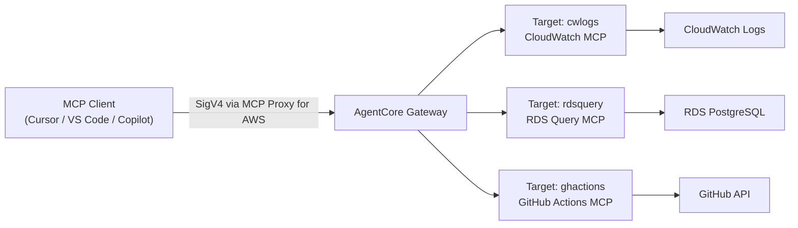

**課題**: クライアント（Cursor）側のLLMがどのツールを呼ぶか判断しており、複数ツールを横断した調査はユーザーが手動で指示する必要がある。

## 目標構成

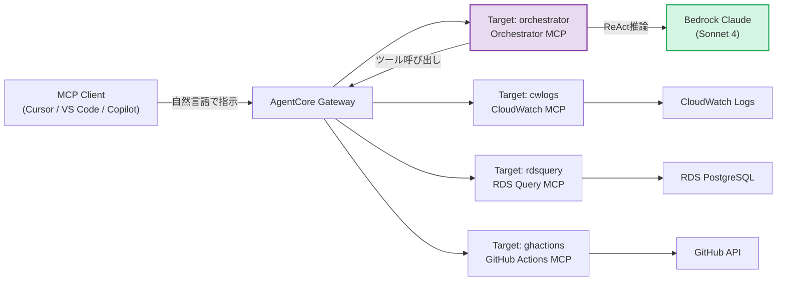

**ポイント**: オーケストレーターは自身もGateway上のMCPサーバーでありながら、Gatewayを経由して他のMCPツールをクライアントとして呼び出す。

---

## アーキテクチャ詳細

### 既存MCPサーバーとの構成比較

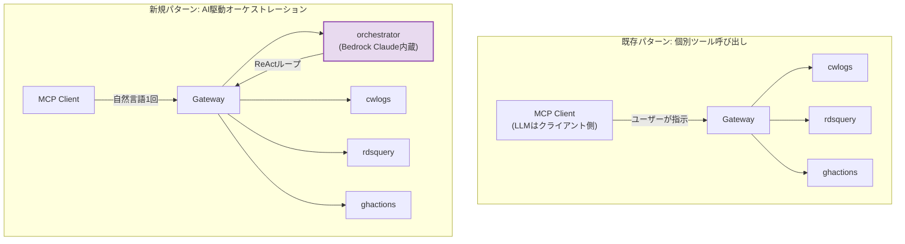

**オーケストレーターはサーバーサイドでLLMを実行**するため、クライアント（Cursor）は1回の自然言語入力だけで複雑な横断調査が完了する。

### コンポーネント図

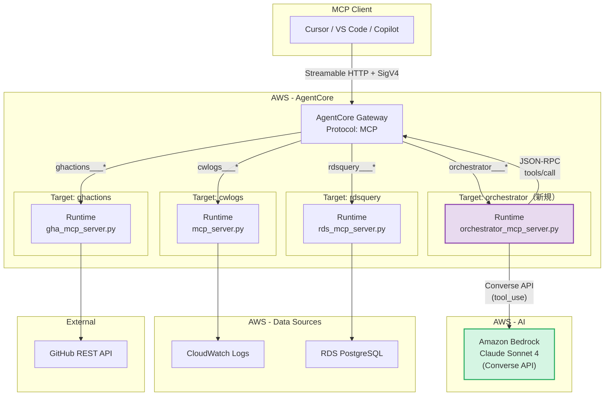

---

## ReAct ループ設計

### ReAct パターンとは

ReAct（Reason + Act）は、LLMが「考える → ツールを呼ぶ → 結果を見る → 次の行動を決める」を繰り返すエージェントパターン。

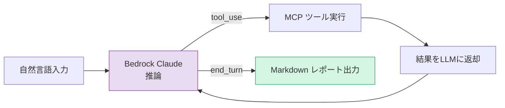

### ループ詳細

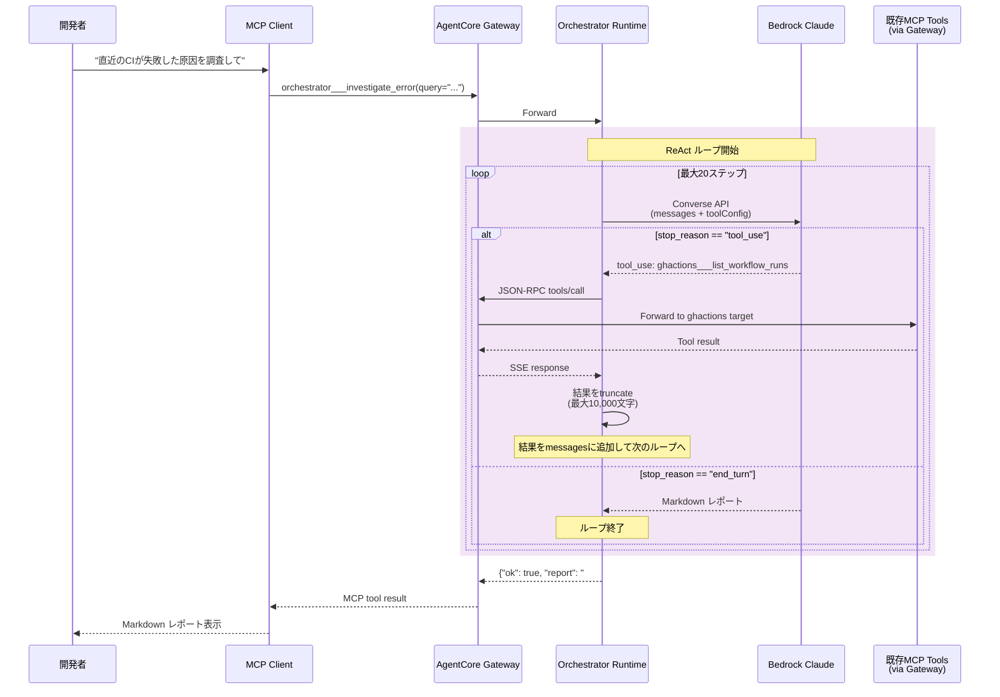

### Bedrock Converse API の tool_use フロー

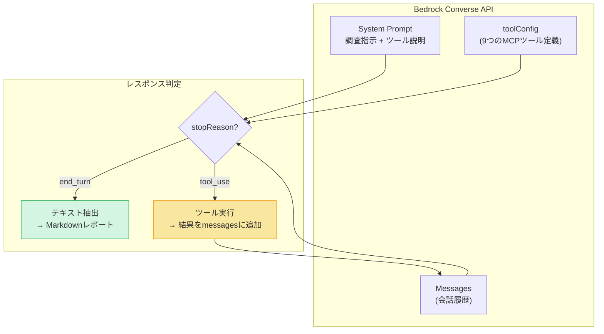

---

## MCP Server 設計

### 提供ツール一覧

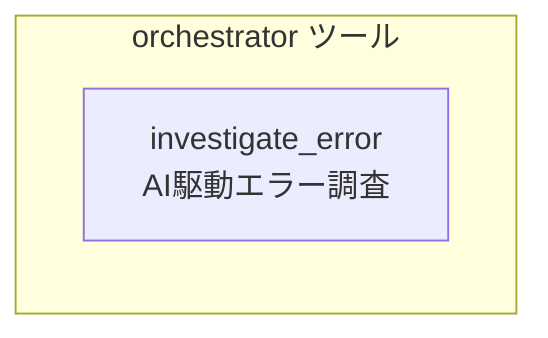

| ツール名 | 説明 | パラメータ |
|---|---|---|
| `investigate_error` | 自然言語でエラーや障害を調査し、Markdownレポートを生成 | `query: str` |

### ツール詳細

#### `investigate_error`

```python
@mcp.tool()
def investigate_error(query: str) -> dict[str, Any]:
    """Investigate a production error or DevOps issue using AI-driven analysis.

    The orchestrator automatically queries CloudWatch logs, RDS database,
    and GitHub Actions to build a comprehensive Markdown investigation report.

    Args:
        query: Natural language description of the error or issue to investigate.
              Examples:
              - "直近のデプロイが失敗した原因を調べて"
              - "backendのECSタスクで500エラーが出ている原因を特定して"
              - "CIが失敗している原因を調査して"
    """
```

**レスポンス例:**
```json
{
  "ok": true,
  "report": "# Investigation Report\n\n## Summary\nCIが失敗した主な原因は...\n\n## Investigation Steps\n1. ...\n\n## Root Cause\n...\n\n## Evidence\n```\nActiveRecord::ConnectionNotEstablished...\n```\n\n## Recommended Actions\n1. ...\n\n---\n*Generated at: 2026-03-20T12:41:11Z by DevOps Investigation Agent*",
  "model": "us.anthropic.claude-sonnet-4-20250514-v1:0",
  "elapsed_seconds": 91.6,
  "queried_at": "2026-03-20T12:41:11.782778+00:00"
}
```

### 利用可能なサブツール（Bedrock Claude が自動選択）

| ツール名 | 所属Target | 説明 |
|---|---|---|
| `cwlogs___query_cloudwatch_insights` | cwlogs | CloudWatch Logs Insightsクエリ実行 |
| `rdsquery___query_rds` | rdsquery | SQL読み取りクエリ実行 |
| `rdsquery___list_tables` | rdsquery | テーブル一覧取得 |
| `rdsquery___describe_table` | rdsquery | テーブルスキーマ取得 |
| `ghactions___list_workflows` | ghactions | ワークフロー定義一覧 |
| `ghactions___list_workflow_runs` | ghactions | ワークフロー実行履歴 |
| `ghactions___get_workflow_run` | ghactions | 実行詳細取得 |
| `ghactions___get_workflow_run_jobs` | ghactions | ジョブ・ステップ一覧 |
| `ghactions___get_job_logs` | ghactions | ジョブログ取得 |

---

## レポート出力フォーマット

Bedrock Claudeは以下の構造のMarkdownレポートを生成する。

```markdown
# Investigation Report

## Summary
（1段落のエグゼクティブサマリー）

## Investigation Steps
（番号付きの調査手順と発見事項）

## Root Cause
（根本原因の明確な説明）

## Evidence
（結論を裏付けるログ・クエリ結果・ジョブ出力）

## Recommended Actions
（問題解決のための具体的な次のステップ）

---
*Generated at: {timestamp} by DevOps Investigation Agent*
```

---

## ユースケース

### ユースケース 1: CI失敗の調査

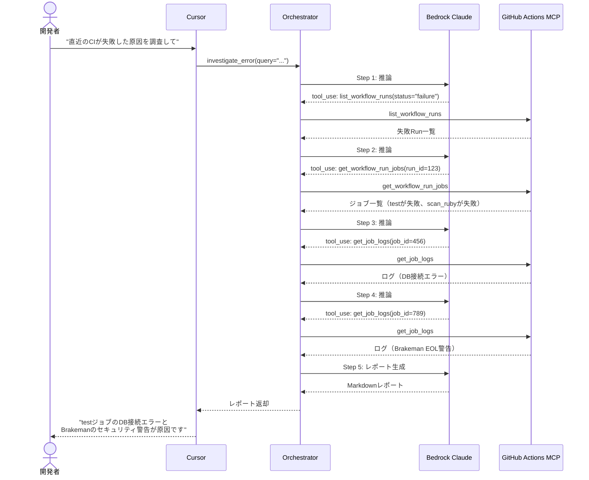

### ユースケース 2: 本番障害の横断調査

```mermaid
graph TB
    subgraph "横断調査フロー"
        Q["開発者: デプロイ後にエラーが出ている"]

        S1["1. ghactions___list_workflow_runs<br/>→ 直近のデプロイ状態確認"]
        S2["2. ghactions___get_job_logs<br/>→ デプロイログ確認"]
        S3["3. cwlogs___query_cloudwatch_insights<br/>→ ECSアプリログでエラー検索"]
        S4["4. rdsquery___list_tables<br/>→ テーブル構成確認"]
        S5["5. rdsquery___query_rds<br/>→ マイグレーション状態確認"]
        S6["6. Markdown レポート出力"]

        Q --> S1
        S1 --> S2
        S2 --> S3
        S3 --> S4
        S4 --> S5
        S5 --> S6
    end

    style S1 fill:#f9e79f,stroke:#f39c12
    style S2 fill:#f9e79f,stroke:#f39c12
    style S3 fill:#aed6f1,stroke:#2980b9
    style S4 fill:#d5f5e3,stroke:#27ae60
    style S5 fill:#d5f5e3,stroke:#27ae60
    style S6 fill:#e8daef,stroke:#8e44ad
```

**全ステップが自動実行**される。ユーザーは最初の1回の指示のみ。

---

## セキュリティ設計

### 多層防御

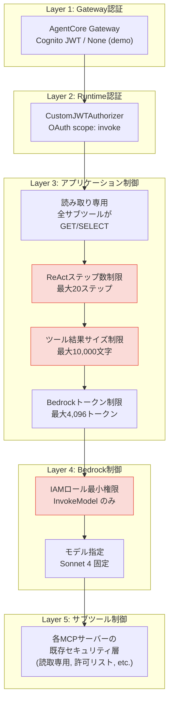

### Bedrock IAM ポリシー

```json
{
  "Statement": [
    {
      "Sid": "BedrockInvokeModel",
      "Effect": "Allow",
      "Action": [
        "bedrock:InvokeModel",
        "bedrock:InvokeModelWithResponseStream"
      ],
      "Resource": [
        "arn:aws:bedrock:us-east-1::foundation-model/anthropic.*"
      ]
    }
  ]
}
```

### 安全な設計ポイント

| ポイント | 説明 |
|---|---|
| サブツールは読み取り専用 | CloudWatch=クエリ、RDS=SELECT、GitHub=GET API |
| 結果のtruncate | LLMコンテキスト溢れを防止（10,000文字/ツール結果） |
| ステップ数上限 | 無限ループ防止（最大20ステップ） |
| Bedrock認証 | IAMロールによるサービス間認証 |
| シークレット管理 | Secrets Manager経由でランタイム設定を注入 |

---

## ディレクトリ構成

```
devops_agent/
├── mcp_server.py                          # 既存: CloudWatch MCP Server
├── rds_mcp_server.py                      # 既存: RDS MCP Server
├── gha_mcp_server.py                      # 既存: GitHub Actions MCP Server
├── orchestrator_mcp_server.py             # 新規: Orchestrator MCP Server
├── Dockerfile                             # 既存: CloudWatch用
├── Dockerfile.rds                         # 既存: RDS用
├── Dockerfile.gha                         # 既存: GitHub Actions用
├── Dockerfile.orchestrator                # 新規: Orchestrator用
├── requirements.txt                       # 既存
├── requirements-rds.txt                   # 既存
├── requirements-gha.txt                   # 既存
├── requirements-orchestrator.txt          # 新規
└── terraform/
    ├── # 既存ファイル（変更あり）
    ├── locals.tf                          # 更新: Orchestrator用ローカル変数追加
    ├── variables.tf                       # 更新: Orchestrator用変数追加
    ├── outputs.tf                         # 更新: Orchestrator用出力追加
    ├── # 新規ファイル
    ├── orchestrator_runtime.tf            # 新規: Runtime + ECR + IAM + Secrets
    ├── orchestrator_gateway_target.tf     # 新規: Gateway Target追加
    └── templates/
        ├── orchestrator_runtime.yaml.tftpl         # 新規: Runtime CFn テンプレート
        └── orchestrator_gateway_target.yaml.tftpl  # 新規: Gateway Target CFn テンプレート
```

---

## Terraform リソース追加一覧

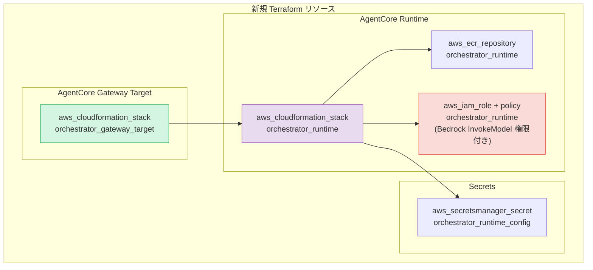

### 既存MCPサーバーとの比較

| 項目 | CloudWatch MCP | RDS MCP | GitHub Actions MCP | Orchestrator MCP (新規) |
|---|---|---|---|---|
| データソース | CloudWatch Logs | RDS PostgreSQL | GitHub REST API | **既存MCP全ツール + Bedrock** |
| 接続方式 | boto3 (IAM) | Lambda Proxy | httpx + PAT | **httpx (Gateway) + boto3 (Bedrock)** |
| ネットワーク | Public API | Lambda (VPC) | Public API | **Public API** |
| 認証 | IAMロール | IAMロール + DB | GitHub PAT | **IAMロール (Bedrock)** |
| Lambda | 不要 | 必要 | 不要 | **不要** |
| VPC | 不要 | 必要 | 不要 | **不要** |
| Target名 | `cwlogs` | `rdsquery` | `ghactions` | **`orchestrator`** |
| ツール数 | 1 | 3 | 5 | **1** |
| Container | `Dockerfile` | `Dockerfile.rds` | `Dockerfile.gha` | **`Dockerfile.orchestrator`** |
| 追加依存 | boto3 | boto3 | httpx, boto3 | **httpx, boto3** |
| 複雑度 | 低 | 高 | 低 | **中（ReActロジック）** |

---

## 設定値一覧

### 環境変数 (Orchestrator MCP Server)

| 変数名 | 説明 | デフォルト |
|---|---|---|
| `BEDROCK_MODEL_ID` | Bedrock推論プロファイルID | `us.anthropic.claude-sonnet-4-20250514-v1:0` |
| `GATEWAY_MCP_URL` | AgentCore GatewayのMCPエンドポイントURL | (必須) |
| `MAX_REACT_STEPS` | ReActループの最大ステップ数 | `20` |
| `BEDROCK_MAX_TOKENS` | Bedrockレスポンスの最大トークン数 | `4096` |
| `TOOL_RESULT_MAX_CHARS` | ツール結果のtruncate上限文字数 | `10000` |
| `RUNTIME_CONFIG_SECRET_ID` | Runtime設定のSecrets Manager ARN | (必須) |

### Terraform 変数

| 変数名 | 説明 | デフォルト |
|---|---|---|
| `orchestrator_runtime_image_tag` | コンテナイメージタグ | `latest` |
| `orchestrator_bedrock_model_id` | Bedrock推論プロファイルID | `us.anthropic.claude-sonnet-4-20250514-v1:0` |
| `orchestrator_max_react_steps` | ReActループ最大ステップ数 | `10` |
| `orchestrator_bedrock_max_tokens` | Bedrockレスポンス最大トークン数 | `4096` |

---

## 実装ステップ

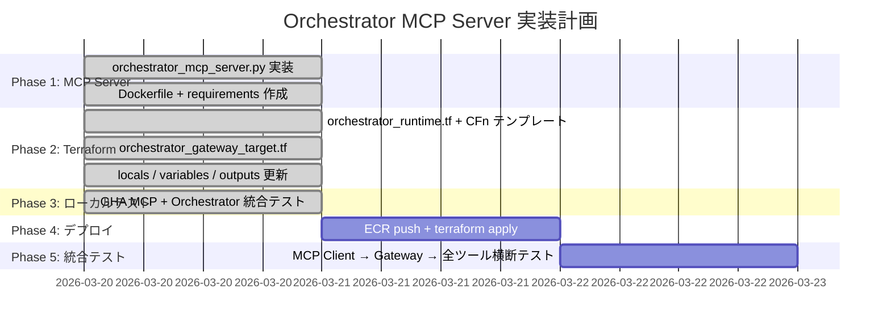

---

## データフロー詳細

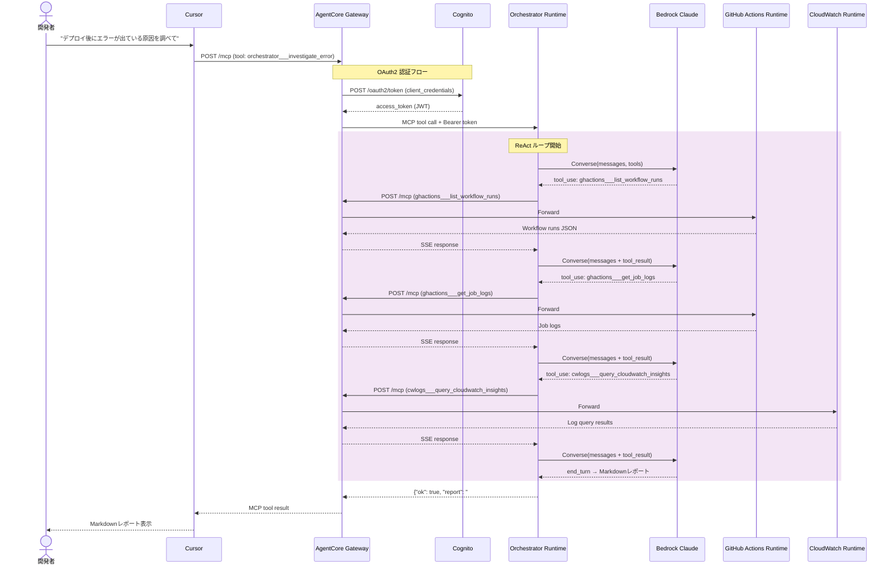

---

## Cursor 連携

### 設定

`.mcp.json` はGateway URLを指しており、オーケストレーターのデプロイ後は自動的に `orchestrator___investigate_error` ツールが利用可能になる。**設定変更は不要**。

```json
{
  "mcpServers": {
    "devops-agent": {
      "url": "https://devops-agent-prod-xxxxx-gateway-xxxxx.gateway.bedrock-agentcore.us-east-1.amazonaws.com/mcp"
    }
  }
}
```

### 利用イメージ

```
ユーザー: @devops-agent 直近のデプロイが失敗した原因を調べて

Cursor: orchestrator___investigate_error を呼び出しています...

(内部でBedrock Claudeが GitHub Actions → CloudWatch → RDS を自動調査)

Cursor:
# Investigation Report

## Summary
CIが失敗した主な原因は、データベース接続の問題と...

## Root Cause
1. PostgreSQLサーバーへの接続が拒否...
2. BrakemanがEOLのRails/Rubyバージョンを検出...

## Recommended Actions
1. CI workflow内のPostgreSQLサービス設定を確認...
2. Railsバージョンのアップグレード...
```

---

## 実装済みテスト結果（2026-03-20）

ローカル環境でオーケストレーター → GitHub Actions MCPサーバーの統合テストを実施。

### テスト構成

```
Orchestrator (port 8002) → GHA MCP Server (port 8001) → GitHub API
      ↕
Bedrock Claude Sonnet 4 (us-east-1)
```

### テスト入力

```
"直近のCIが失敗した原因を調査して"
```

### 結果

| 項目 | 値 |
|---|---|
| 実行時間 | 91.6秒 |
| ReActステップ数 | 約15ステップ |
| 呼び出されたツール | list_workflow_runs, get_workflow_run_jobs, get_job_logs (複数回) |
| 特定された原因 | DB接続エラー + Brakeman EOL警告 |
| レポート品質 | Summary, Root Cause, Evidence, Recommended Actions 全セクション生成 |

### 生成されたレポート（抜粋）

```markdown
# Investigation Report

## Summary
CIが失敗した主な原因は、データベース接続の問題とセキュリティ検査（Brakeman）での
警告です。

## Root Cause
1. **データベース接続エラー**: PostgreSQLサーバーへの接続が拒否され、
   `rails db:prepare`コマンドが失敗
2. **セキュリティ警告**: Brakemanがend-of-life（EOL）のRailsとRubyバージョンを検出

## Evidence
### テストジョブの失敗
ActiveRecord::ConnectionNotEstablished: connection to server at "::1",
port 5432 failed: Connection refused

### セキュリティスキャンの警告
Support for Rails 7.1.6 ended on 2025-10-01
Support for Ruby 3.2.9 ends on 2026-03-31
```
