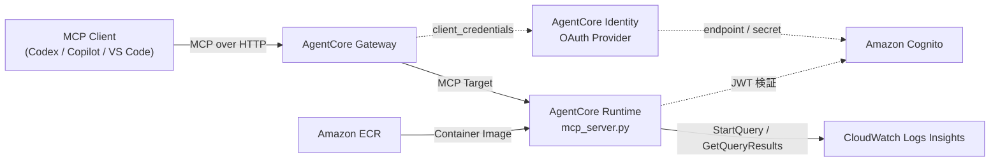
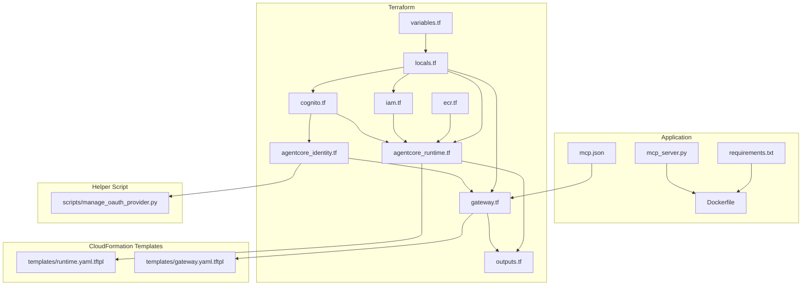

# プロジェクト構成ドキュメント

このリポジトリは、CloudWatch Logs Insights を実行する Python 製 MCP サーバーと、それを AWS Bedrock AgentCore Runtime / Gateway にデプロイするための Terraform 群で構成されています。

## 全体像



## ディレクトリ構成

```text
.
├── .env.example
├── Dockerfile
├── README.md
├── docs/
│   └── project-structure.md
├── mcp.json
├── mcp_server.py
├── requirements.txt
├── __pycache__/                    # Python 実行時生成物
└── terraform/
    ├── agentcore_identity.tf
    ├── agentcore_runtime.tf
    ├── cognito.tf
    ├── ecr.tf
    ├── gateway.tf
    ├── iam.tf
    ├── locals.tf
    ├── outputs.tf
    ├── providers.tf
    ├── scripts/
    │   └── manage_oauth_provider.py
    ├── templates/
    │   ├── gateway.yaml.tftpl
    │   └── runtime.yaml.tftpl
    ├── terraform.tfstate*          # Terraform 状態ファイル
    ├── terraform.tfvars.example
    ├── variables.tf
    └── versions.tf
```

## レイヤ別の責務

### 1. アプリケーション層

- `mcp_server.py`
  - MCP サーバー本体です。
  - `query_cloudwatch_insights` ツールを公開します。
  - `.env` を読み込み、対象 log group の制御、CloudWatch Logs Insights の実行、結果整形、`/healthz` を提供します。
- `requirements.txt`
  - `boto3`, `mcp`, `starlette`, `uvicorn`, `python-dotenv` など実行依存を定義します。
- `Dockerfile`
  - `mcp_server.py` を AgentCore Runtime へ載せるためのコンテナイメージ定義です。
- `mcp.json`
  - AgentCore Gateway URL を指す MCP クライアント設定のサンプルです。

### 2. インフラ定義層

- `terraform/agentcore_runtime.tf`
  - AgentCore Runtime 用 CloudFormation Stack を作成します。
- `terraform/gateway.tf`
  - AgentCore Gateway と Gateway Target 用 CloudFormation Stack を作成します。
- `terraform/cognito.tf`
  - Runtime の JWT 検証と Gateway の client credentials に使う Cognito を作成します。
- `terraform/agentcore_identity.tf`
  - AgentCore Identity の OAuth Credential Provider を `local-exec` と `external` で補完します。
- `terraform/iam.tf`
  - Runtime / Gateway の IAM Role と Policy を定義します。
- `terraform/ecr.tf`
  - Runtime イメージを保持する ECR repository を作成します。
- `terraform/locals.tf`
  - 命名規則、log group 導出、Cognito endpoint、Runtime invoke URL などの共通値を集約します。
- `terraform/variables.tf`
  - デプロイ時に切り替えるパラメータを定義します。
- `terraform/outputs.tf`
  - Gateway URL、Runtime ARN、Cognito 情報などの参照値を出力します。
- `terraform/providers.tf`, `terraform/versions.tf`
  - Terraform / Provider のバージョン制約と AWS provider 設定です。

### 3. 補助スクリプト / テンプレート

- `terraform/scripts/manage_oauth_provider.py`
  - Bedrock AgentCore Control API を呼び、OAuth Provider の作成・更新・取得・削除を行います。
- `terraform/templates/runtime.yaml.tftpl`
  - AgentCore Runtime リソースの CloudFormation テンプレートです。
- `terraform/templates/gateway.yaml.tftpl`
  - AgentCore Gateway / GatewayTarget リソースの CloudFormation テンプレートです。

## ファイル間の依存関係



## 読み進める順番

1. `README.md`
   - セットアップ、デプロイ手順、利用方法を把握します。
2. `mcp_server.py`
   - 実際に公開している MCP ツールと入出力、制約を確認します。
3. `terraform/locals.tf` と `terraform/variables.tf`
   - 命名規則、切替パラメータ、対象 log group の決まり方を確認します。
4. `terraform/cognito.tf` `terraform/agentcore_identity.tf` `terraform/iam.tf`
   - 認証と権限の前提を確認します。
5. `terraform/agentcore_runtime.tf` `terraform/gateway.tf`
   - Runtime / Gateway のデプロイ形態を確認します。

## このリポジトリで重要な設計ポイント

- 実行ロジックは `mcp_server.py` に集約され、責務が明確です。
- AWS 上の実体作成は Terraform が担いますが、AgentCore Runtime / Gateway 自体は CloudFormation テンプレート経由で作成されます。
- Gateway から Runtime への接続は Cognito + AgentCore Identity OAuth Provider を介した `client_credentials` フローです。
- CloudWatch Logs Insights の実行権限は Runtime IAM Role のみにあり、Gateway 自身は CloudWatch を直接触りません。
- 対象 log group は `.env` と Terraform 変数の両方で制御され、アプリ側と IAM 側の二重ガードになっています。
