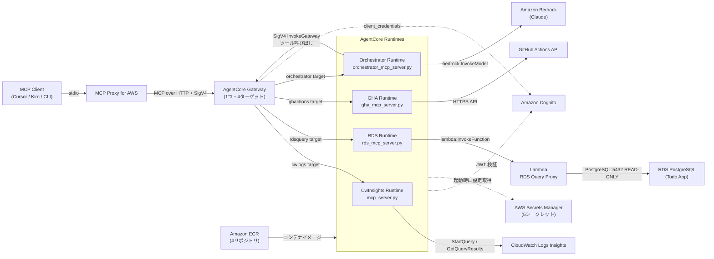
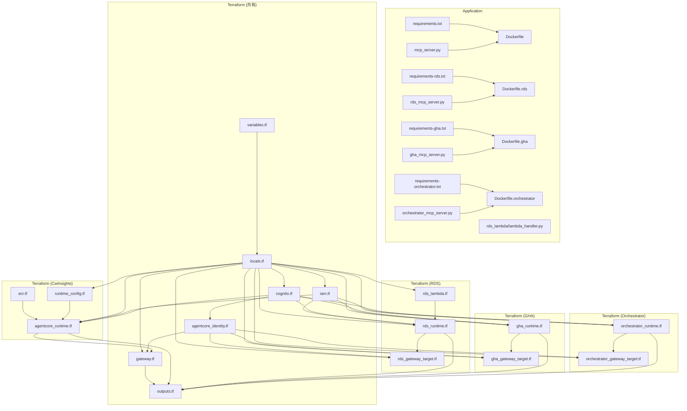

# プロジェクト構成ドキュメント

このリポジトリは、Todo アプリの障害調査を自然言語で行う **DevOps Investigation Agent Platform** です。
4 つの Python 製 MCP サーバーと、それらを AWS Bedrock AgentCore Runtime / Gateway にデプロイするための Terraform 群で構成されています。

## 全体像



## ディレクトリ構成

```text
.
├── Dockerfile                          # CwInsights Runtime イメージ
├── Dockerfile.rds                      # RDS Runtime イメージ
├── Dockerfile.gha                      # GHA Runtime イメージ
├── Dockerfile.orchestrator             # Orchestrator Runtime イメージ
├── README.md
├── claude.md
│
├── mcp_server.py                       # CwInsights MCP サーバー本体
├── rds_mcp_server.py                   # RDS Query MCP サーバー本体
├── gha_mcp_server.py                   # GitHub Actions MCP サーバー本体
├── orchestrator_mcp_server.py          # Orchestrator MCP サーバー本体（ReAct Agent）
│
├── requirements.txt                    # CwInsights Runtime 依存
├── requirements-rds.txt                # RDS Runtime 依存
├── requirements-gha.txt                # GHA Runtime 依存
├── requirements-orchestrator.txt       # Orchestrator Runtime 依存
│
├── mcp.json                            # MCP Proxy for AWS クライアント設定サンプル
│
├── rds_lambda/                         # Lambda RDS Query Proxy
│   ├── lambda_handler.py               # READ-ONLY クエリ実行ハンドラ
│   └── requirements.txt                # psycopg2-binary など
│
├── docs/
│   ├── architecture.drawio             # AWS 構成図（2ページ: Agent Platform / Todo App）
│   ├── project-structure.md            # 本ドキュメント
│   ├── rds-mcp-server-design.md
│   ├── github-actions-mcp-server-design.md
│   └── orchestrator-mcp-server-design.md
│
└── terraform/
    ├── providers.tf
    ├── versions.tf
    ├── variables.tf
    ├── locals.tf
    ├── outputs.tf
    │
    ├── cognito.tf                      # 共有 Cognito（全 Runtime で共用）
    ├── agentcore_identity.tf           # AgentCore OAuth Provider 登録
    ├── iam.tf                          # Runtime / Gateway IAM Role・Policy
    │
    ├── ecr.tf                          # CwInsights Runtime 用 ECR
    ├── agentcore_runtime.tf            # CwInsights Runtime CloudFormation Stack
    ├── runtime_config.tf               # CwInsights Runtime 用 Secrets Manager シークレット
    ├── gateway.tf                      # AgentCore Gateway CloudFormation Stack
    │
    ├── rds_lambda.tf                   # Lambda RDS Query Proxy（VPC 内）
    ├── rds_runtime.tf                  # RDS Runtime ECR + CloudFormation Stack + IAM
    ├── rds_gateway_target.tf           # Gateway への rdsquery ターゲット登録
    │
    ├── gha_runtime.tf                  # GHA Runtime ECR + CloudFormation Stack + IAM
    ├── gha_gateway_target.tf           # Gateway への ghactions ターゲット登録
    │
    ├── orchestrator_runtime.tf         # Orchestrator Runtime ECR + CloudFormation Stack + IAM
    ├── orchestrator_gateway_target.tf  # Gateway への orchestrator ターゲット登録
    │
    ├── scripts/
    │   ├── manage_oauth_provider.py        # AgentCore OAuth Provider CRUD
    │   ├── manage_runtime_config_secret.py # Secrets Manager シークレット値投入
    │   └── get_ecr_image_digest.py         # ECR イメージダイジェスト取得（external data）
    │
    ├── templates/
    │   ├── runtime.yaml.tftpl              # CwInsights Runtime CloudFormation テンプレート
    │   ├── gateway.yaml.tftpl              # Gateway CloudFormation テンプレート
    │   ├── rds_runtime.yaml.tftpl          # RDS Runtime CloudFormation テンプレート
    │   ├── rds_gateway_target.yaml.tftpl   # RDS Gateway Target CloudFormation テンプレート
    │   ├── gha_runtime.yaml.tftpl          # GHA Runtime CloudFormation テンプレート
    │   ├── gha_gateway_target.yaml.tftpl   # GHA Gateway Target CloudFormation テンプレート
    │   ├── orchestrator_runtime.yaml.tftpl          # Orchestrator Runtime CloudFormation テンプレート
    │   └── orchestrator_gateway_target.yaml.tftpl   # Orchestrator Gateway Target CloudFormation テンプレート
    │
    ├── terraform.tfvars
    └── terraform.tfvars.example
```

## レイヤ別の責務

### 1. アプリケーション層（MCP サーバー群）

#### `mcp_server.py` — CwInsights MCP サーバー

- MCP ツール `query_cloudwatch_insights` を公開します。
- `log_group_name`・`minutes`・`query` を受け取り、CloudWatch Logs Insights の StartQuery / GetQueryResults を実行して結果を返します。
- 対象 log group は runtime config (`ALLOWED_LOG_GROUP_NAMES`) と IAM Policy の二重で制御されます。

#### `rds_mcp_server.py` — RDS Query MCP サーバー

- MCP ツール `execute_rds_query` を公開します。
- VPC 内の Lambda Proxy (`{base}-rds-query-proxy`) を `lambda:InvokeFunction` で呼び出し、READ-ONLY な PostgreSQL クエリを実行します。
- Runtime 自身は VPC 外で動作し、直接 RDS に接続しません。

#### `gha_mcp_server.py` — GitHub Actions MCP サーバー

- MCP ツール `list_workflow_runs` を公開します。
- GitHub Actions REST API を HTTPS で呼び出し、ワークフロー実行履歴・ステータスを返します。
- GitHub PAT は Secrets Manager から取得します。

#### `orchestrator_mcp_server.py` — Orchestrator MCP サーバー（ReAct Agent）

- MCP ツール `investigate` を公開します。
- Amazon Bedrock (Claude) を使った ReAct ループで調査を実行します。
- 調査中は AgentCore Gateway に `SigV4 InvokeGateway` でコールバックし、cwlogs・rdsquery・ghactions の各ツールを自律的に呼び出します。
- Root Cause Analysis（根本原因・証拠・推奨アクション）を生成して返します。

#### `rds_lambda/lambda_handler.py` — Lambda RDS Query Proxy

- RDS Runtime から呼ばれる Lambda 関数です。
- Secrets Manager から DB 接続情報を取得し、`psycopg2` で PostgreSQL に接続します。
- `statement_timeout` と `MAX_ROWS` で安全に READ-ONLY クエリを実行します。
- Todo App の VPC 内 Private Subnet に配置されます。

### 2. インフラ定義層

#### 共有インフラ

| ファイル                | 責務                                                                                                  |
| ----------------------- | ----------------------------------------------------------------------------------------------------- |
| `cognito.tf`            | 全 Runtime が共用する User Pool / Domain / Resource Server / App Client を作成します。                |
| `agentcore_identity.tf` | AgentCore Identity の OAuth Credential Provider を `terraform_data` + Python スクリプトで登録します。 |
| `iam.tf`                | Gateway / Runtime 各 IAM Role・Policy、Gateway caller 用の invoke policy を定義します。               |
| `gateway.tf`            | 1 つの AgentCore Gateway CloudFormation Stack を作成します（Authorizer: AWS_IAM）。                   |

#### CwInsights MCP サーバー関連

| ファイル               | 責務                                                                             |
| ---------------------- | -------------------------------------------------------------------------------- |
| `ecr.tf`               | CwInsights Runtime 用 ECR リポジトリを作成します。                               |
| `runtime_config.tf`    | 対象 log group 名などを格納する Secrets Manager シークレットを作成・更新します。 |
| `agentcore_runtime.tf` | CwInsights Runtime CloudFormation Stack（cwlogs ターゲット）を作成します。       |

#### RDS MCP サーバー関連

| ファイル                | 責務                                                                                                                    |
| ----------------------- | ----------------------------------------------------------------------------------------------------------------------- |
| `rds_lambda.tf`         | Lambda Proxy 関数・IAM Role・SG・CW Logs・SG Rule を作成します。デプロイ時に `pip install` + zip をローカル実行します。 |
| `rds_runtime.tf`        | RDS Runtime 用 ECR・IAM Role・Secrets Manager シークレット・CloudFormation Stack を作成します。                         |
| `rds_gateway_target.tf` | Gateway への rdsquery ターゲット CloudFormation Stack を作成します。                                                    |

#### GitHub Actions MCP サーバー関連

| ファイル                | 責務                                                                                            |
| ----------------------- | ----------------------------------------------------------------------------------------------- |
| `gha_runtime.tf`        | GHA Runtime 用 ECR・IAM Role・Secrets Manager シークレット・CloudFormation Stack を作成します。 |
| `gha_gateway_target.tf` | Gateway への ghactions ターゲット CloudFormation Stack を作成します。                           |

#### Orchestrator MCP サーバー関連

| ファイル                         | 責務                                                                                                                                   |
| -------------------------------- | -------------------------------------------------------------------------------------------------------------------------------------- |
| `orchestrator_runtime.tf`        | Orchestrator Runtime 用 ECR・IAM Role（`bedrock:InvokeModel` 含む）・Secrets Manager シークレット・CloudFormation Stack を作成します。 |
| `orchestrator_gateway_target.tf` | Gateway への orchestrator ターゲット CloudFormation Stack を作成します。                                                               |

### 3. 補助スクリプト / テンプレート

| ファイル                                  | 責務                                                                                                |
| ----------------------------------------- | --------------------------------------------------------------------------------------------------- |
| `scripts/manage_oauth_provider.py`        | Bedrock AgentCore Control API を呼び、OAuth Provider の作成・更新・取得・削除を行います。           |
| `scripts/manage_runtime_config_secret.py` | Terraform apply 時に Secrets Manager シークレットの値を更新します（全 Runtime 共通）。              |
| `scripts/get_ecr_image_digest.py`         | ECR からイメージの `@sha256:...` ダイジェストを取得します（`external` data source 経由）。          |
| `templates/*.yaml.tftpl`                  | AgentCore Runtime / Gateway / GatewayTarget の CloudFormation テンプレートです（合計 8 ファイル）。 |

## ファイル間の依存関係



## 読み進める順番

1. **`README.md`** — セットアップ・デプロイ手順・利用方法を把握します。
2. **`terraform/variables.tf` と `terraform/locals.tf`** — 命名規則、切替パラメータ、対象 log group の決まり方を確認します。
3. **`mcp_server.py`** — CwInsights ツールの入出力・制約を確認します（他 3 サーバーの参考にもなります）。
4. **`rds_lambda/lambda_handler.py` と `terraform/rds_lambda.tf`** — Lambda Proxy の動作と VPC 構成を確認します。
5. **`rds_mcp_server.py` / `gha_mcp_server.py`** — RDS / GitHub Actions ツールの実装を確認します。
6. **`orchestrator_mcp_server.py`** — ReAct ループ・Gateway コールバック・根本原因分析の生成ロジックを確認します。
7. **`terraform/cognito.tf` `terraform/agentcore_identity.tf` `terraform/iam.tf`** — 認証・権限の前提を確認します。
8. **`terraform/*_runtime.tf` `terraform/*_gateway_target.tf`** — 各 Runtime / Gateway Target のデプロイ形態を確認します。
9. **`docs/*.md` `docs/architecture.drawio`** — 各サーバーの設計ドキュメントと AWS 構成図を確認します。

## 重要な設計ポイント

- **MCP サーバーは 4 本、Gateway は 1 本。** 1 つの AgentCore Gateway に `cwlogs` / `rdsquery` / `ghactions` / `orchestrator` の 4 ターゲットを登録しています。
- **Orchestrator は唯一 LLM（Claude）を持つ。** 他の 3 Runtime は LLM を持たない MCP ツールサーバーです。Orchestrator が Gateway にコールバックして他のツールを呼び出す "Supervisor + Tools" パターンです。
- **RDS への直接接続は Lambda 経由のみ。** RDS Runtime は VPC 外で動作し、VPC 内の Lambda Proxy を介してのみ PostgreSQL に接続します。Lambda SG → RDS SG の port 5432 のみ許可されています。
- **Cognito は全 Runtime で共用。** 1 つの User Pool / App Client で全 Runtime の JWT 検証と Gateway からの `client_credentials` フローを賄います。
- **コンテナイメージは `@sha256:...` ダイジェスト固定。** `get_ecr_image_digest.py` で取得した digest を使い、イメージの意図しない変更を防ぎます。
- **クライアント → Gateway 接続は AWS_IAM + SigV4。** Gateway → Runtime 接続は Cognito OAuth `client_credentials` フローです。
- **対象 log group は二重ガード。** runtime config (`ALLOWED_LOG_GROUP_NAMES`) と IAM Policy (`logs:StartQuery` リソース) の両方で制御されます。
