# RDS MCP Server 設計書

## 概要

todoアプリのRDS（PostgreSQL）に対してAgent CoreからSQLクエリを実行し、データ調査を行えるMCPサーバーを新規作成する。既存のCloudWatch MCP Server（`devops_agent/mcp_server.py`）と同じアーキテクチャパターンに従い、AgentCore Gateway上に新しいTargetとして追加する。

---

## 現状構成

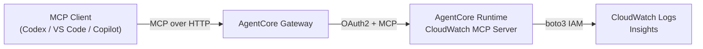

## 目標構成

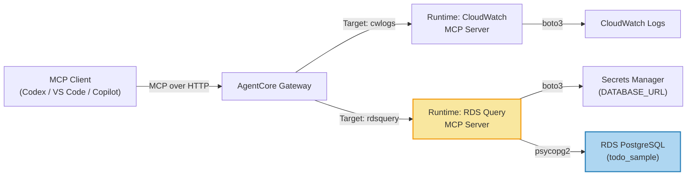

---

## アーキテクチャ詳細

### コンポーネント図

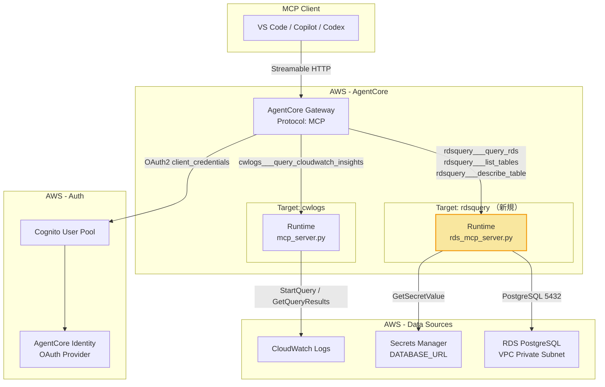

---

## ネットワーク構成

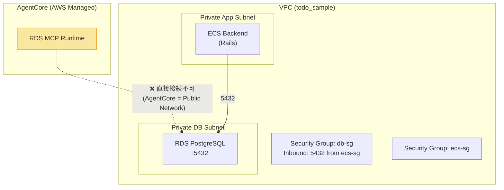

### ネットワーク課題と解決策

AgentCore RuntimeはPublicネットワークモードで動作するため、**VPC内のPrivate RDSに直接接続できない**。以下の3つのアプローチを検討する。

```mermaid
graph TB
    subgraph "案1: RDS Data API 経由（推奨）"
        RT1["RDS MCP Runtime"]
        DataAPI["RDS Data API<br/>(boto3)"]
        RDS1["RDS PostgreSQL"]
        RT1 -->|boto3 rds-data| DataAPI
        DataAPI --> RDS1
    end

    subgraph "案2: RDS Proxy + Public Endpoint"
        RT2["RDS MCP Runtime"]
        Proxy["RDS Proxy<br/>(Public Endpoint)"]
        RDS2["RDS PostgreSQL"]
        RT2 -->|TLS + IAM Auth| Proxy
        Proxy --> RDS2
    end

    subgraph "案3: Lambda Proxy 経由"
        RT3["RDS MCP Runtime"]
        Lambda["Lambda Function<br/>(VPC内)"]
        RDS3["RDS PostgreSQL"]
        RT3 -->|boto3 lambda.invoke| Lambda
        Lambda -->|psycopg2| RDS3
    end

    style RT1 fill:#d5f5e3,stroke:#27ae60,stroke-width:2px
    style DataAPI fill:#d5f5e3,stroke:#27ae60,stroke-width:2px
```

| 案 | メリット | デメリット | 推奨度 |
|---|---|---|---|
| **案1: RDS Data API** | IAM認証のみ、VPC不要、boto3で完結 | Aurora限定（標準RDSは非対応）、RDS再構築が必要 | ⚠️ Auroraへの移行が必要 |
| **案2: RDS Proxy (Public)** | 既存RDSをそのまま利用可能、IAM認証対応 | RDS Proxyの追加コスト、Public Endpoint設定 | ✅ 推奨 |
| **案3: Lambda Proxy** | 既存RDSをそのまま利用、VPC内から接続 | Lambda追加、レイテンシ増加、Cold Start | ✅ 推奨（シンプル） |

---

## 推奨案: Lambda Proxy パターン

既存のRDS構成を変更せず、最もシンプルに実装できる **案3: Lambda Proxy** を推奨する。

### 全体フロー

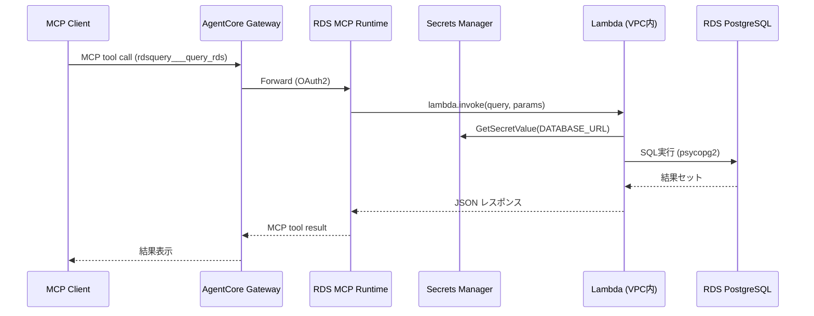

### Lambda 設計

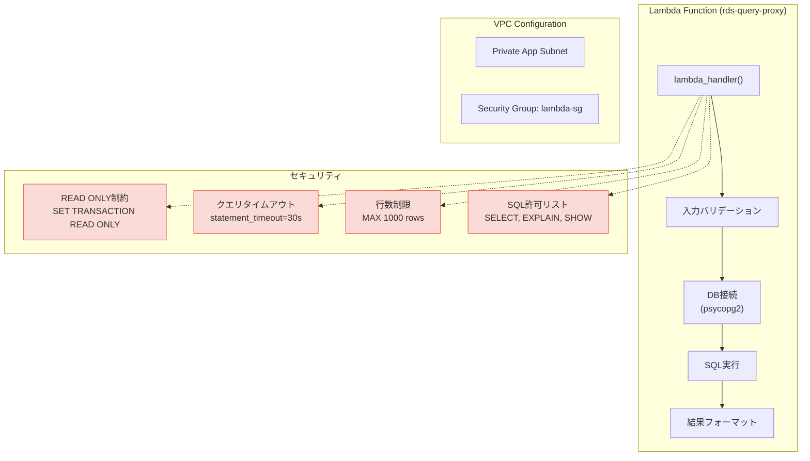

---

## MCP Server 設計

### 提供ツール一覧

| ツール名 | 説明 | パラメータ |
|---|---|---|
| `query_rds` | SQLクエリを実行して結果を返す | `query: str`, `params: list` (optional), `max_rows: int` (default: 100) |
| `list_tables` | データベース内のテーブル一覧を返す | なし |
| `describe_table` | テーブルのスキーマ情報を返す | `table_name: str` |

### ツール詳細

#### `query_rds`

```python
@mcp.tool()
async def query_rds(query: str, params: list = None, max_rows: int = 100) -> str:
    """
    RDS PostgreSQL に対して読み取り専用のSQLクエリを実行する。
    SELECT文のみ許可。max_rowsで返却行数を制限（最大1000）。
    """
```

**レスポンス例:**
```json
{
  "ok": true,
  "query": "SELECT id, title, completed FROM todos WHERE completed = true LIMIT 10",
  "row_count": 3,
  "columns": ["id", "title", "completed"],
  "rows": [
    {"id": 1, "title": "タスク1", "completed": true},
    {"id": 2, "title": "タスク2", "completed": true},
    {"id": 3, "title": "タスク3", "completed": true}
  ],
  "execution_time_ms": 12,
  "truncated": false
}
```

#### `list_tables`

```python
@mcp.tool()
async def list_tables() -> str:
    """データベース内の全テーブルとレコード数を一覧表示する。"""
```

**レスポンス例:**
```json
{
  "ok": true,
  "tables": [
    {"table_name": "todos", "row_count": 42},
    {"table_name": "schema_migrations", "row_count": 5},
    {"table_name": "ar_internal_metadata", "row_count": 1}
  ]
}
```

#### `describe_table`

```python
@mcp.tool()
async def describe_table(table_name: str) -> str:
    """テーブルのカラム定義、インデックス、制約を返す。"""
```

**レスポンス例:**
```json
{
  "ok": true,
  "table_name": "todos",
  "columns": [
    {"name": "id", "type": "bigint", "nullable": false, "default": "nextval('todos_id_seq')"},
    {"name": "title", "type": "character varying", "nullable": false, "default": null},
    {"name": "completed", "type": "boolean", "nullable": false, "default": "false"},
    {"name": "created_at", "type": "timestamp(6)", "nullable": false, "default": null},
    {"name": "updated_at", "type": "timestamp(6)", "nullable": false, "default": null}
  ],
  "indexes": [
    {"name": "todos_pkey", "columns": ["id"], "unique": true}
  ]
}
```

---

## セキュリティ設計

### 多層防御

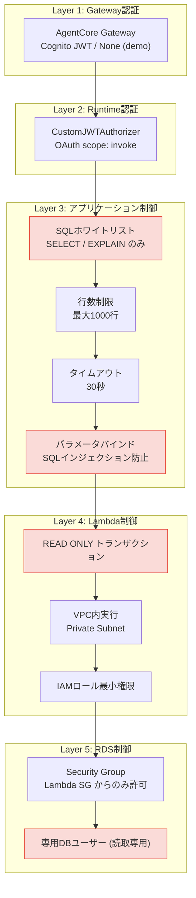

### 読み取り専用DBユーザー

```sql
-- Lambda用の読み取り専用ユーザーを作成
CREATE USER rds_mcp_readonly WITH PASSWORD '...';
GRANT CONNECT ON DATABASE backend_production TO rds_mcp_readonly;
GRANT USAGE ON SCHEMA public TO rds_mcp_readonly;
GRANT SELECT ON ALL TABLES IN SCHEMA public TO rds_mcp_readonly;
ALTER DEFAULT PRIVILEGES IN SCHEMA public GRANT SELECT ON TABLES TO rds_mcp_readonly;
```

---

## ディレクトリ構成

```
devops_agent/
├── mcp_server.py                          # 既存: CloudWatch MCP Server
├── rds_mcp_server.py                      # 新規: RDS MCP Server
├── rds_lambda/                            # 新規: Lambda Proxy
│   ├── lambda_handler.py                  #   Lambda関数本体
│   └── requirements.txt                   #   psycopg2-binary, boto3
├── Dockerfile                             # 既存: CloudWatch用
├── Dockerfile.rds                         # 新規: RDS MCP Server用
├── requirements.txt                       # 既存
├── requirements-rds.txt                   # 新規: RDS MCP Server依存
├── mcp.json                               # 更新: rdsquery target追加
└── terraform/
    ├── # 既存ファイル (変更なし)
    ├── variables.tf
    ├── locals.tf
    ├── iam.tf                             # 更新: RDS用IAMポリシー追加
    ├── cognito.tf                         # 更新: RDS用スコープ追加（共有可）
    ├── ecr.tf                             # 更新: RDS用リポジトリ追加
    ├── # 新規ファイル
    ├── rds_lambda.tf                      # 新規: Lambda + SG + IAM
    ├── rds_runtime.tf                     # 新規: AgentCore Runtime (RDS)
    ├── rds_gateway_target.tf              # 新規: Gateway Target追加
    ├── rds_runtime_config.tf              # 新規: Secrets Manager設定
    └── templates/
        ├── runtime.yaml.tftpl             # 既存
        ├── rds_runtime.yaml.tftpl         # 新規: RDS Runtime CF テンプレート
        └── gateway_target_rds.yaml.tftpl  # 新規: RDS Target CF テンプレート
```

---

## Terraform リソース追加一覧

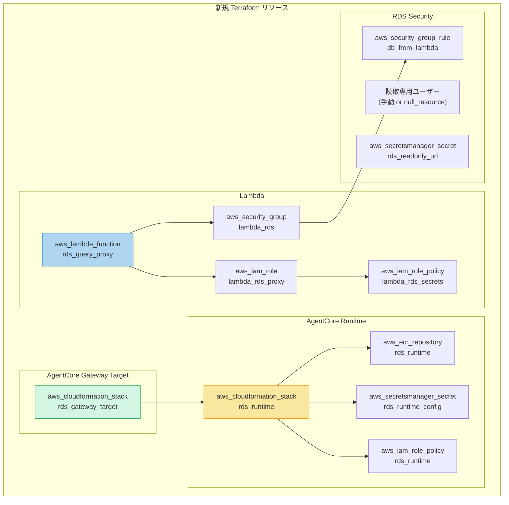

### 既存リソースへの変更

| ファイル | 変更内容 |
|---|---|
| `iam.tf` | RDS Runtime用IAMロール追加、Lambda invoke権限 |
| `cognito.tf` | RDS Runtime用スコープ追加（または既存スコープを共有） |
| `ecr.tf` | RDS Runtime用ECRリポジトリ追加 |
| `security_and_data.tf` (todo_sample側) | DB Security GroupにLambda SGからのIngressルール追加 |

---

## 実装ステップ

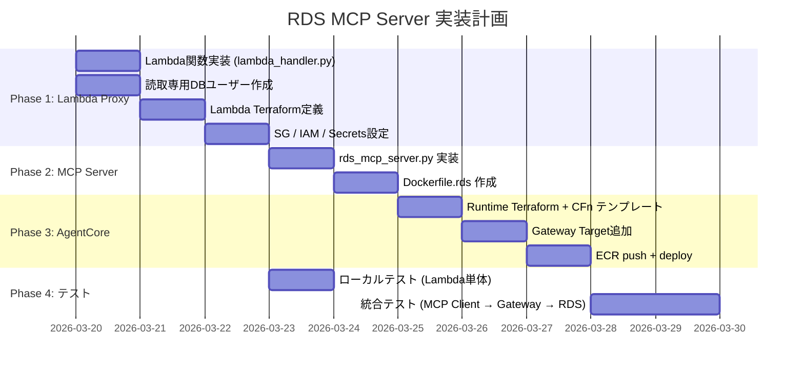

---

## データフロー詳細

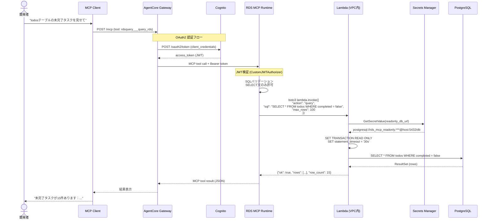

---

## 設定値一覧

### 環境変数 (RDS MCP Server)

| 変数名 | 説明 | デフォルト |
|---|---|---|
| `RDS_LAMBDA_FUNCTION_NAME` | Lambda Proxy関数名 | (必須) |
| `QUERY_MAX_ROWS` | 最大返却行数 | `1000` |
| `QUERY_TIMEOUT_SECONDS` | Lambda呼び出しタイムアウト | `45` |
| `RUNTIME_CONFIG_SECRET_ID` | Secrets Manager ARN | (必須) |

### 環境変数 (Lambda)

| 変数名 | 説明 | デフォルト |
|---|---|---|
| `DB_SECRET_ARN` | 読取専用DB接続文字列のSecret ARN | (必須) |
| `STATEMENT_TIMEOUT_MS` | SQLタイムアウト (ms) | `30000` |
| `MAX_ROWS` | 最大行数ハードリミット | `1000` |

---

## 既存CloudWatch MCPとの比較

| 項目 | CloudWatch MCP | RDS MCP (新規) |
|---|---|---|
| データソース | CloudWatch Logs | RDS PostgreSQL |
| 接続方式 | boto3 (IAM) | Lambda Proxy → psycopg2 |
| ネットワーク | Public API | Lambda (VPC) → Private RDS |
| 認証 | IAMロール | IAMロール + DB認証 |
| Target名 | `cwlogs` | `rdsquery` |
| ツール数 | 1 | 3 |
| 読取専用保証 | CloudWatch API自体が読取 | アプリ + DB + トランザクション |
| Container | `Dockerfile` | `Dockerfile.rds` |
| ECR | 既存リポジトリ | 新規リポジトリ |
